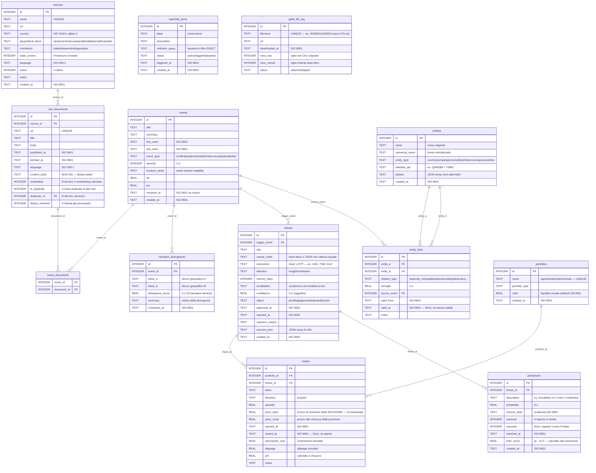
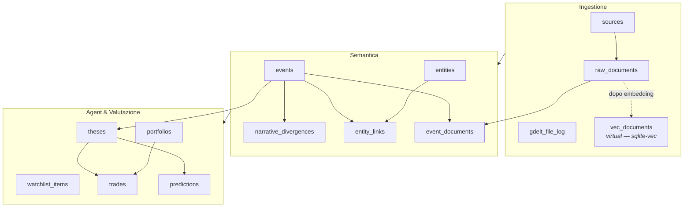

# Schema del Database — Pathosphere

SQLite + sqlite-vec. File: `data/db/pathosphere.db`.  
Backup = copia del file. Raw storicizzati in Parquet (fonte di verità ricostruibile).

---

## Diagramma ER — Vista completa



---

## Diagramma ER — Vista semplificata (domini funzionali)



---

## Tabelle — Riferimento rapido

| Tabella | Fase | Righe tipiche | Note |
|---|---|---|---|
| `sources` | 0 | ~20 | Seeded una volta, aggiornate raramente |
| `raw_documents` | 1 | migliaia/giorno | `content_hash` previene duplicati esatti |
| `events` | 2 | centinaia/giorno | Aggregano N documenti sullo stesso evento |
| `event_documents` | 2 | join N:M | |
| `narrative_divergences` | 2 | decine/giorno | Solo eventi con ≥2 blocchi coperti |
| `entities` | 2 | crescita lenta | Deduplicate via `wikidata_qid` |
| `entity_links` | 2 | crescita lenta | Grafo relazionale entità |
| `watchlist_items` | 3 | decine | Indicatori osservabili per scenario ACH |
| `theses` | 3 | 2-3/giorno | Approvate manualmente |
| `portfolios` | 3 | 3 fissi | agent, random, benchmark |
| `trades` | 3 | 2-3/giorno | `price_open` immutabile dopo apertura |
| `predictions` | 3 | 2-3/giorno | Risolte vero/falso a scadenza |
| `gdelt_file_log` | 1 | ~96/giorno | Tracking per resume download |
| `vec_documents` | 2 | = embedded docs | Tabella virtuale sqlite-vec |

---

## Vincoli e garanzie di integrità

### Dedup documenti (tre livelli)

```
Livello 1 — Esatto URL:      url UNIQUE in raw_documents
Livello 2 — Esatto contenuto: content_hash SHA-256 UNIQUE in raw_documents
Livello 3 — Semantico KNN:   is_duplicate=1 se cosine >= 0.92 in finestra 72h
                              calcolato da semantic/dedup.py via sqlite-vec KNN
```

### No lookahead bias nel paper trading

```
trades.price_open = prezzo yfinance al momento dell'approvazione della tesi
                  = MAI aggiornato retroattivamente
```

### Gerarchia portafogli di controllo

```
portfolios.name IN ('agent', 'random', 'benchmark')
  agent     — tesi approvate dall'utente
  random    — stesse dimensioni trade, ticker casuali
  benchmark — buy & hold indice (es. SPY)
```

### Brier Score (calibrazione Tetlock)

```
brier_score = (probability - outcome)²
  outcome ∈ {0, 1}
  brier_score ∈ [0, 1]  — 0 = predizione perfetta
```

---

## Estensioni future

| Componente | Note |
|---|---|
| `vec_documents` | ✅ Popolata da `semantic/embedder.py` — multilingual-e5-small 384-dim, vettori unitari, blob `struct.pack("384f")` |
| Parquet raw | Storico >90 giorni archiviato in `data/parquet/`, interrogabile con DuckDB |
| Turso/libSQL | Drop-in replacement per SQLite con replica cloud automatica |
