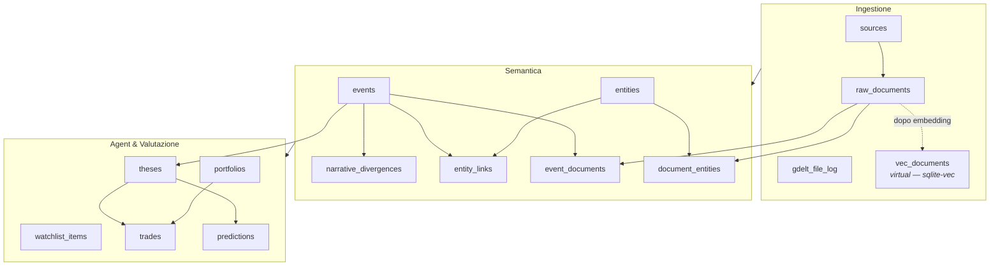

# Schema del Database — Pathosphere

SQLite + sqlite-vec. File: `data/db/pathosphere.db`.  
Backup = copia del file. Raw storicizzati in Parquet (fonte di verità ricostruibile).

---

## Diagramma ER — Vista completa

```mermaid
erDiagram

    sources {
        INTEGER id PK
        TEXT name "UNIQUE"
        TEXT url
        TEXT country "ISO 3166-1 alpha-2"
        TEXT geopolitical_block "western|china|russia|arab|india|latam|africa|other"
        TEXT orientation "state|independent|opposition"
        INTEGER state_control "0=nessuno  3=totale"
        TEXT language "ISO 639-1"
        INTEGER active "1=attiva"
        TEXT notes
        TEXT created_at "ISO 8601"
    }

    raw_documents {
        INTEGER id PK
        INTEGER source_id FK
        TEXT origin "ingestor: gdelt|rss|comtrade|portwatch|usgs|firms"
        TEXT url "UNIQUE"
        TEXT title
        TEXT body
        TEXT published_at "ISO 8601"
        TEXT fetched_at "ISO 8601"
        TEXT language "ISO 639-1"
        TEXT content_hash "SHA-256 — dedup esatto"
        INTEGER embedded "0=da fare  1=embedding calcolato"
        INTEGER is_duplicate "1=near-duplicate di altro doc"
        INTEGER duplicate_of FK "id del doc canonico"
        INTEGER dedup_checked "1=dedup già processato"
        INTEGER ner_done "1=NER già eseguito su questo doc"
    }

    events {
        INTEGER id PK
        TEXT title
        TEXT summary
        TEXT first_seen "ISO 8601"
        TEXT last_seen "ISO 8601"
        TEXT event_type "conflict|epidemic|trade|infrastructure|political|other"
        TEXT origin "ingestor: gdelt|rss|comtrade|portwatch|usgs|firms"
        INTEGER severity "1-5"
        TEXT location_name "nome human-readable"
        REAL lat
        REAL lon
        TEXT resolved_at "ISO 8601 se chiuso"
        TEXT created_at "ISO 8601"
    }

    event_documents {
        INTEGER event_id FK
        INTEGER document_id FK
    }

    gdelt_events {
        INTEGER global_event_id PK "GDELT GlobalEventID (1 riga GDELT)"
        INTEGER event_id FK "cluster 5-tupla in events"
        INTEGER document_id FK "URL fonte"
        TEXT sqldate "grezzo, inaffidabile (audit)"
        TEXT date_added "DATEADDED → ISO, data canonica"
        TEXT event_code "CAMEO EventCode pieno"
        TEXT event_root_code "CAMEO root → events.event_type"
        INTEGER quad_class "1..4 coop/conflitto x verbale/materiale"
        REAL goldstein "-10..+10 impatto teorico"
        REAL avg_tone "tono medio articoli"
        INTEGER num_mentions
        INTEGER num_sources
        INTEGER num_articles
    }

    comtrade_flows {
        INTEGER id PK
        INTEGER document_id FK "doc sintetico"
        INTEGER reporter_code "ISO numerico reporter"
        TEXT reporter_iso
        INTEGER partner_code "0 = World"
        TEXT cmd_code "HS 8541|8542|8486"
        TEXT flow_code "M import | X export"
        TEXT period "YYYYMM"
        REAL primary_value "valore commerciale USD"
        REAL net_weight "kg, se presente"
    }

    fire_metrics {
        TEXT area PK "area allineata ai chokepoint"
        TEXT date PK "ISO YYYY-MM-DD (acq_date)"
        INTEGER n_detections "rilevazioni fuoco giorno"
        REAL frp_sum "fire radiative power totale MW"
        REAL frp_max "picco FRP singolo pixel MW"
        REAL lat "centroide rilevazioni"
        REAL lon
        TEXT source "VIIRS_SNPP_NRT | VIIRS_SNPP_SP | ..."
        TEXT fetched_at "ISO 8601"
    }

    document_entities {
        INTEGER document_id FK "raw_documents.id"
        INTEGER entity_id FK "entities.id"
        INTEGER mentions "conteggio menzioni nel doc"
    }

    geocode_cache {
        TEXT query PK "testo query Nominatim"
        REAL lat
        REAL lon
        TEXT display_name
        TEXT fetched_at "ISO 8601"
    }

    narrative_divergences {
        INTEGER id PK
        INTEGER event_id FK
        TEXT block_a "blocco geopolitico A"
        TEXT block_b "blocco geopolitico B"
        REAL divergence_score "0-1 (0=narrativa identica)"
        TEXT summary "sintesi della divergenza"
        TEXT computed_at "ISO 8601"
    }

    entities {
        INTEGER id PK
        TEXT name "nome originale"
        TEXT canonical_name "forma normalizzata"
        TEXT entity_type "country|company|commodity|infrastructure|person|other"
        TEXT wikidata_qid "es. Q540386 = TSMC"
        INTEGER wikidata_checked "1=lookup Wikidata già tentato"
        TEXT aliases "JSON array nomi alternativi"
        TEXT created_at "ISO 8601"
    }

    entity_links {
        INTEGER id PK
        INTEGER entity_a FK
        INTEGER entity_b FK
        TEXT relation_type "depends_on|supplies|sanctions|ally|adversary|..."
        REAL strength "0-1"
        INTEGER source_event FK
        TEXT valid_from "ISO 8601"
        TEXT valid_to "ISO 8601 — NULL se ancora valida"
        TEXT notes
    }

    watchlist_items {
        INTEGER id PK
        TEXT label "nome breve"
        TEXT description
        TEXT indicator_query "keyword o filtro GDELT"
        TEXT status "active|triggered|expired"
        TEXT triggered_at "ISO 8601"
        TEXT created_at "ISO 8601"
    }

    theses {
        INTEGER id PK
        INTEGER trigger_event FK
        INTEGER prediction_id FK "v2: auto-economic prediction creata ad approvazione"
        INTEGER debate_id FK "debate pipeline context"
        TEXT title
        TEXT causal_chain "testo libero o JSON con catena causale"
        TEXT instrument "ticker o ETF — es. USO, TSM, GLD"
        TEXT direction "long|short|neutral"
        INTEGER horizon_days
        TEXT invalidation "condizione che invalida la tesi"
        REAL confidence "0-1 soggettivo"
        TEXT status "pending|approved|rejected|closed"
        TEXT approved_at "ISO 8601"
        TEXT rejected_at "ISO 8601"
        TEXT rejection_reason
        TEXT sources_json "JSON array di URL"
        REAL price_snapshot "prezzo snapshot al momento generazione (no-lookahead)"
        TEXT created_at "ISO 8601"
    }

    portfolios {
        INTEGER id PK
        TEXT name "agent|random|benchmark — UNIQUE"
        TEXT portfolio_type
        REAL cash "liquidità virtuale (default 100.000)"
        TEXT created_at "ISO 8601"
    }

    trades {
        INTEGER id PK
        INTEGER portfolio_id FK
        INTEGER thesis_id FK
        TEXT ticker
        TEXT direction "buy|sell"
        REAL quantity
        REAL price_open "prezzo al momento della DECISIONE — no lookahead"
        REAL price_close "prezzo alla chiusura della posizione"
        TEXT opened_at "ISO 8601"
        TEXT closed_at "ISO 8601 — NULL se aperta"
        REAL transaction_cost "commissioni simulate"
        REAL slippage "slippage simulato"
        REAL pnl "calcolato a chiusura"
        TEXT notes
    }

    predictions {
        INTEGER id PK
        INTEGER thesis_id FK "v2: geopolitical→thesis→trade chain; NULL per predictions non legate"
        INTEGER trade_id FK "v2: link a trade (economic only)"
        TEXT description "es. Escalation in X entro 2 settimane"
        REAL probability "0-1"
        TEXT horizon_date "scadenza ISO 8601"
        INTEGER resolved "0=aperta  1=risolta"
        INTEGER outcome "DEPRECATO — legacy backfill di outcome_on_time"
        INTEGER outcome_eventual "v2: event ever happened (timing-independent)"
        INTEGER outcome_on_time "v2: event happened within horizon_date"
        TEXT resolved_date "v2: actual event date or evaluation date YYYY-MM-DD"
        TEXT macro_area "v2: world|economic (CHECK default world per pre-v2)"
        TEXT prediction_type "v2: geopolitical|political|social|economic"
        TEXT origin_scope "v2: locale|nazionale|regionale|multilaterale|globale (world only)"
        TEXT impact_scope "v2: locale|nazionale|regionale|multilaterale|globale (world only)"
        TEXT time_horizon_class "v2: breve(≤30gg)|medio(≤180gg)|lungo — computed at creation"
        REAL brier_score "v2: (probability - outcome_eventual)^2 — 0=perfect, 1=worst"
        REAL time_adjusted_score "v2: (1-brier)×max(0, 1-alpha×|resolved-horizon|days) — primary metric"
        TEXT resolved_at "ISO 8601"
        TEXT created_at "ISO 8601"
    }

    prediction_domains {
        INTEGER prediction_id FK "references predictions(id)"
        TEXT domain "tassonomia: conflitto_armato|tensione_militare|politica_interna|diplomazia|commercio|tecnologia|infrastruttura|finanza|salute|clima_risorse"
        INTEGER is_primary "1 se dominio principale"
        TEXT PRIMARY_KEY "(prediction_id, domain)"
    }

    prediction_revisions {
        INTEGER id PK
        INTEGER prediction_id FK "references predictions(id)"
        REAL probability "probabilità revisione"
        TEXT rationale "motivo revisione (opzionale)"
        TEXT revised_at "ISO 8601 timestamp"
    }

    gdelt_file_log {
        INTEGER id PK
        TEXT filename "UNIQUE — es. 20260611153000.export.CSV.zip"
        TEXT url
        TEXT downloaded_at "ISO 8601"
        INTEGER rows_raw "righe nel CSV originale"
        INTEGER rows_stored "righe inserite dopo filtro"
        TEXT status "ok|error|skipped"
    }

    %% ─── Relazioni ────────────────────────────────────
    sources          ||--o{  raw_documents        : "source_id"
    raw_documents    ||--o{  event_documents      : "document_id"
    events           ||--o{  event_documents      : "event_id"
    events           ||--o{  gdelt_events         : "event_id"
    raw_documents    ||--o{  gdelt_events         : "document_id"
    raw_documents    ||--o{  comtrade_flows       : "document_id"
    raw_documents    ||--o{  document_entities    : "document_id"
    entities         ||--o{  document_entities    : "entity_id"
    events           ||--o{  narrative_divergences: "event_id"
    events           ||--o{  theses               : "trigger_event"
    events           ||--o{  entity_links         : "source_event"
    entities         ||--o{  entity_links         : "entity_a"
    entities         ||--o{  entity_links         : "entity_b"
    portfolios       ||--o{  trades               : "portfolio_id"
    theses           ||--o{  trades               : "thesis_id"
    theses           ||--o{  predictions          : "thesis_id"
```



---

## Diagramma ER — Vista semplificata (domini funzionali)



---

## Tabelle — Riferimento rapido

| Tabella | Fase | Righe tipiche | Note |
|---|---|---|---|
| `sources` | 0 | ~20 | Seeded una volta, aggiornate raramente |
| `raw_documents` | 1 | migliaia/giorno | `content_hash` previene duplicati esatti; `origin` = ingestor di provenienza |
| `events` | 2 | centinaia/giorno | Aggregano N documenti sullo stesso evento; `origin` = ingestor |
| `event_documents` | 2 | join N:M | |
| `gdelt_events` | 1 | 1/riga GDELT | Dettaglio numerico per `GlobalEventID` (Goldstein/tone/mentions) → `events` |
| `comtrade_flows` | 1 | 1/record commerciale | Valori numerici flussi (USD, kg) accanto al doc sintetico |
| `chokepoint_metrics` | 1 | 1/(chokepoint, giorno) | Timeseries transiti PortWatch; anomalie z-score → `events`. PK `(portid, date)`, no FK |
| `fire_metrics` | 1 | 1/(area, giorno) | Timeseries rilevazioni FIRMS; surge z-score → `events`. PK `(area, date)`, no FK |
| `document_entities` | 2 | N:M | Menzioni per doc × entità (output NER) |
| `narrative_divergences` | 2 | decine/giorno | Solo eventi con ≥2 blocchi coperti |
| `entities` | 2 | crescita lenta | Deduplicate via `wikidata_qid`; `wikidata_checked=1` dopo lookup |
| `entity_links` | 2 | crescita lenta | Grafo relazionale entità |
| `geocode_cache` | 2 | crescita lenta | Cache query Nominatim (miss incluse con lat/lon NULL) |
| `watchlist_items` | 3 | decine | Indicatori osservabili per scenario ACH |
| `theses` | 3 | 2-3/giorno | Approvate manualmente |
| `portfolios` | 3 | 3 fissi | agent, random, benchmark |
| `trades` | 3 | 2-3/giorno | `price_open` immutabile dopo apertura |
| `predictions` | 3 | 2-3/giorno | Risolte vero/falso a scadenza |
| `gdelt_file_log` | 1 | ~96/giorno | Tracking per resume download |
| `vec_documents` | 2 | = embedded docs | Tabella virtuale sqlite-vec |

---

## Vincoli e garanzie di integrità

### Dedup documenti (tre livelli)

```
Livello 1 — Esatto URL:      url UNIQUE in raw_documents
Livello 2 — Esatto contenuto: content_hash SHA-256 UNIQUE in raw_documents
Livello 3 — Semantico KNN:   is_duplicate=1 se cosine >= 0.92 in finestra 72h
                              calcolato da semantic/dedup.py via sqlite-vec KNN
```

### No lookahead bias nel paper trading

```
trades.price_open = prezzo yfinance al momento dell'approvazione della tesi
                  = MAI aggiornato retroattivamente
```

### Gerarchia portafogli di controllo

```
portfolios.name IN ('agent', 'random', 'benchmark')
  agent     — tesi approvate dall'utente
  random    — stesse dimensioni trade, ticker casuali
  benchmark — buy & hold indice (es. SPY)
```

### Scoring v2 (calibrazione Tetlock + timing)

**Brier Score** (qualità direzione):
```
brier_score = (probability - outcome_eventual)²
  outcome_eventual ∈ {0, 1}  — did event ever happen (timing-independent)
  brier_score ∈ [0, 1]  — 0 = perfetto, 0.25 = random (p=0.5), 1 = pessimo
```

**Time-Adjusted Score** (metrica operativa primaria):
```
time_adjusted_score = 0 if outcome_eventual = false (evento non accaduto)
                    = (1 - brier_score) × max(0, 1 - alpha × |resolved_date - horizon_date| days)

  outcome_on_time = outcome_eventual AND resolved_date ≤ horizon_date
  alpha = timing_penalty_alpha (config, default 0.001) — penalità per giorno di ritardo
  time_adjusted_score ∈ [0, 1]  — 1 = predizione perfetta on-time, 0 = fallimento
```

**Doppio metricaggio:**
- `time_adjusted_score` primaria (operativa, sensibile a timing)
- `brier_score` secondaria (Tetlock-compatibile, pre-v2 legacy)
- `get_calibration()` reporta entrambe le medie breakdown per bucket/macro_area/prediction_type

---

## Estensioni future

| Componente | Note |
|---|---|
| `vec_documents` | ✅ Popolata da `semantic/embedder.py` — multilingual-e5-small 384-dim, vettori unitari, blob `struct.pack("384f")` |
| Parquet raw | Storico >90 giorni archiviato in `data/parquet/`, interrogabile con DuckDB |
| Turso/libSQL | Drop-in replacement per SQLite con replica cloud automatica |
